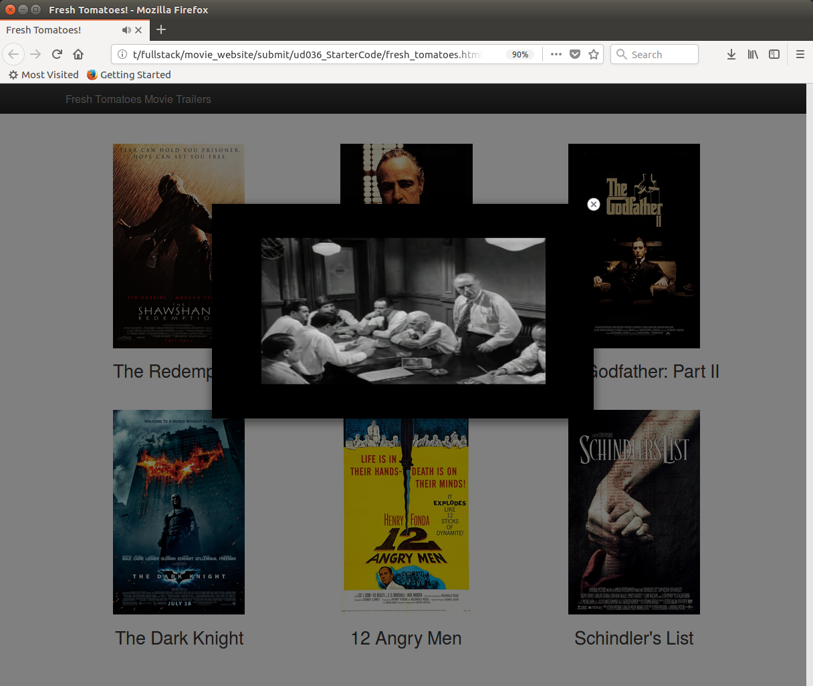

# Movie Website Creator

This is a python script which generates a webpage which displays movies and it's trailers.

<div align="center">
  <br><br>
</div>

## Getting Started

These instructions will get you a copy of the project up and running on your local machine.

### Prerequisites

Python 2.7: You can download it from the official site - [Python Software Foundation](https://www.python.org "Python Software Foundation")

### Installing

Make a copy of the repository:

```bash
git clone https://github.com/henkeldi/ud036_StarterCode.git
```

### Running the program

1. In the command line, switch to `ud036_StarterCode/` directory,
2. Run:
```bash
python entertainment_center.py
```

## License

This project is licensed under the MIT License - see the [LICENSE.md](LICENSE.md) file for details

## References
 * [IMDb Charts](http://www.imdb.com/chart/top?ref_=nv_mv_250_6)

